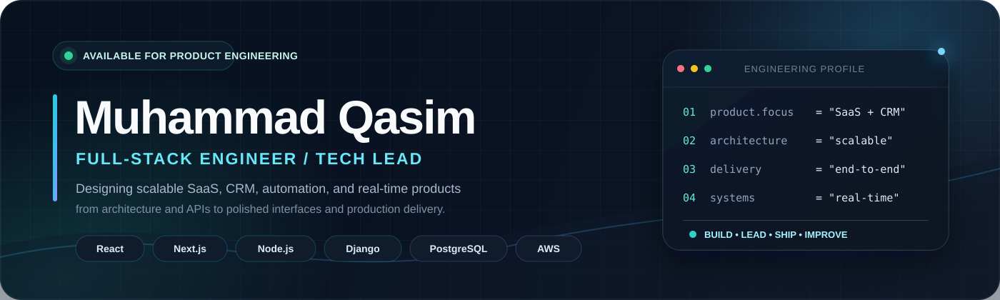

  

  
  
  

  <strong>Product-minded full-stack engineer building reliable systems from architecture to production.</strong> 
  3+ years across SaaS products, enterprise CRMs, real-time platforms, automation, AI integrations and technical leadership.

---

## Engineering Profile

<table>
  <tr>
    <td width="33%" valign="top">
      <strong>Product Delivery</strong>  
      I take features from requirements and architecture through APIs, UI, testing, deployment, and production support.
    </td>
    <td width="33%" valign="top">
      <strong>Scalable Systems</strong>  
      I design modular backends, background processing, real-time workflows, data layers, and cloud-ready services.
    </td>
    <td width="33%" valign="top">
      <strong>Technical Leadership</strong>  
      I support sprint planning, code reviews, engineering decisions, mentoring, and dependable team delivery.
    </td>
  </tr>
</table>

### Current Focus

<table>
  <tr>
    <td width="50%" valign="top">
      <strong>Building</strong>
      <ul>
        <li>Scalable SaaS and CRM platforms</li>
        <li>Real-time communication products</li>
        <li>Workflow and business-process automation</li>
        <li>Analytics-driven operational dashboards</li>
      </ul>
    </td>
    <td width="50%" valign="top">
      <strong>Growing</strong>
      <ul>
        <li>Kubernetes and production orchestration</li>
        <li>Advanced DevOps and observability</li>
        <li>Applied AI and LLM integrations</li>
        <li>System design for high-scale workloads</li>
      </ul>
    </td>
  </tr>
</table>

---

## Technical Toolkit

**Frontend**

  
  
  
  
  
  

**Backend and Real-Time**

  
  
  
  
  
  

**Data, Cloud, and Delivery**

  
  
  
  
  
  

---

## Selected Product Work

<table>
  <tr>
    <td width="50%" valign="top">
      <h3>CallLoom</h3>
      
calllom is a real time call traking system inbound and outbound calls track and people lookup functionalites availablb.

      
<code>React</code> <code>Node.js</code> <code>Socket.IO</code> <code>MongoDB</code>

      <a href="https://callloom.com"><strong>View product →</strong></a>
    </td>
    <td width="50%" valign="top">
      <h3>ScoreTab</h3>
      
Live scoreboard and analytics SaaS with real-time operational visibility.

      
<code>Next.js</code> <code>TypeScript</code> <code>Redis</code>

      <a href="https://reporting.veeivs.com/login"><strong>View product →</strong></a>
    </td>
  </tr>
  <tr>
    <td width="50%" valign="top">
      <h3>Devspero</h3>
      
Developer collaboration workspace for structured team communication and delivery.

      
<code>Next.js</code> <code>NestJS</code> <code>PostgreSQL</code>

      <a href="https://devspero.com/"><strong>View product →</strong></a>
    </td>
    <td width="50%" valign="top">
      <h3>SSI CRM</h3>
      
Enterprise CRM with workflow automation, operational tools, and structured customer data.

      
<code>React</code> <code>Django</code> <code>PostgreSQL</code>

      <a href="https://crm.ssi-medicare.com"><strong>View product →</strong></a>
    </td>
  </tr>
  <tr>
    <td width="50%" valign="top">
      <h3>Auto Shield</h3>
      
Lead-verification and workflow automation platform with testing and compliance tooling.

      
<code>Next.js</code> <code>Node.js</code> <code>Automation</code>

      <a href="https://to-shidl-jornaya-testing.vercel.app"><strong>View product →</strong></a>
    </td>
    <td width="50%" valign="top">
      <h3>ShieldMyLife</h3>
      
Insurance policy and claims-management experience focused on clear customer workflows.

      
<code>React</code> <code>Node.js</code> <code>Tailwind CSS</code>

      <a href="https://shieldmylife.com/"><strong>View product →</strong></a>
    </td>
  </tr>
  <tr>
    <td width="50%" valign="top">
      <h3>Email Tracking Pro</h3>
      
Open-and-click tracking analytics with event processing and reporting dashboards.

      
<code>Node.js</code> <code>React</code> <code>Redis</code>

      <a href="https://mailtrack.veeivs.com/"><strong>View product →</strong></a>
    </td>
    <td width="50%" valign="top">
      <h3>KeyNou</h3>
      
Responsive digital-solutions platform built for a fast and consistent web experience.

      
<code>React</code> <code>Express</code> <code>AWS</code>

      <a href="https://keynou.com"><strong>View product →</strong></a>
    </td>
  </tr>
</table>

  <a href="https://my-portfolio-nine-sigma-22.vercel.app/"><strong>Explore more work and case studies →</strong></a>

---

## GitHub Engineering Activity

  

> The analytics image is generated inside this repository by GitHub Actions. It does not depend on a username placeholder in the README.

---

## Certifications

- AWS Certified Solutions Architect - Associate
- Professional Scrum Master (PSM I)
- Advanced React and Node.js coursework

---

  <strong>Open to full-time, freelance, and product-engineering opportunities.</strong> 
  SaaS platforms · CRM systems · automation · real-time applications · technical leadership

  
  

